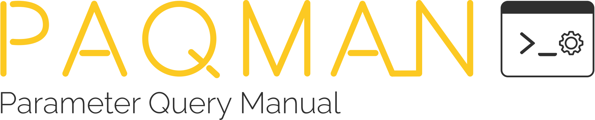
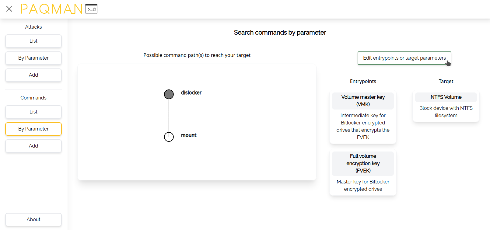

## What is PAQMAN?
PAQMAN is a command line companion tool to improve your pentesting experience. 
It provides you with copy-pastable commands depending on the information you collect or already have to transform them into a successfull attack.

PAQMAN comes without a database as it is intended to be filled by the user to be as flexible as possible.

## Dev team
Paqman is being developed as part of a project at the Offenburg University of Applied Sciences by Nadine Weber (MI7), Nicola Jäger (UN6) and Leon Schmidt (UN6).

## Development

### Tech stack
- Backend: **Go v1.16**
- Frontend: **React JS v17.0.1 _(via `create-react-app`)_**
    - CSS framework: **Tailwind CSS**

### Manual build
- Backend (inside `server/`)
    - Install Go dependencies: `$ go get -d -v ./...`
    - Build Go binary: `$ CGO_ENABLED=1 go install -a -ldflags '-linkmode external -extldflags "-static"' .`
- Frontend (inside `frontend/`)
    - Install NPM dependencies: `$ npm install`
    - Build React frontend: `$ npm run build` &rarr; Static files in `build/`
- Run backend with `./paqman-backend` inside `server/`
- Frontend: http://localhost:3002; API: http://localhost:3002/api

### Docker build
- Build image: `$ docker build -t <your-tag> .`
- Start a container: `$ docker run --name paqman -p "<external-port>:3002" [-v "<your-config>:/config.json:ro"] <your-tag> [<options>]`
    - Make sure, your `"bind_address"` is set to `0.0.0.0:3002` or omitted - otherwise, the service would not be reachable from outside the docker container!
    - Make sure to have a mongo db container running with a hostname of `mongo` on port `27017` (ideally use a docker-compose file)!
- Stop and delete the container: `$ docker stop paqman && docker rm paqman`
- Frontend: http://localhost:3002; API: http://localhost:3002/api

_There is a pre-built docker image at `registry.git.leon.wtf/paqman/paqman:dev` and a prewritten `docker-compose.yml` file in the repositories root directory._

### Dev environment
- Install dependencies _(as described in [Manual Build](#manual-build))_
- Start the mongodb database with `$ docker-compose up [-d]` within `dev_environment/`
    - Database listens on `0.0.0.0:27017`
    - DB web frontend available at http://localhost:8081
- Start the backend with `$ go run .` within `server/` &rarr; listens on `0.0.0.0:3002`
- Start the frontend with `$ npm run start` within `frontend/` &rarr; available at http://localhost:3000 with hot-reloading

_In production, the frontend is served by the Go backend, but it doesn't support Reacts hot-reloading feature as it only serves the `build/` folder. Therefore the frontend is served on it's own port in development._